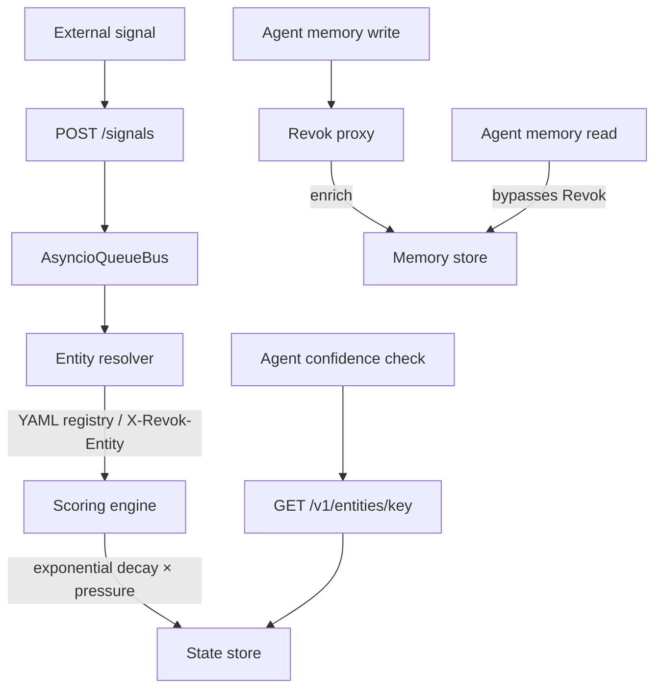

<!-- LOGO -->
<div align="center">
  
  

  <p><strong>The memory validity layer for AI agents.</strong></p>

  <p>
    Every memory system updates beliefs from conversation.<br/>
    None listen to the world changing around them. <strong>Revok does.</strong>
  </p>

  <p>
    <a href="#license"></a>
    
    
    
    
    <a href="#contributing"></a>
  </p>

  <p>
    <a href="#quick-start">Quick start</a> ·
    <a href="#how-it-works">How it works</a> ·
    <a href="#examples">Examples</a> ·
    <a href="#roadmap">Roadmap</a>
  </p>
</div>

<!-- DEMO GIF - coming soon -->


---

## Table of contents

- [The problem](#the-problem)
- [The solution](#the-solution)
- [Features](#features)
- [Quick start](#quick-start)
- [How confidence retrieval works](#how-confidence-retrieval-works)
- [How Revok differs from TTL-based systems](#how-revok-differs-from-ttl-based-systems)
- [Sending signals to Revok](#sending-signals-to-revok)
- [How it works](#how-it-works)
- [Architecture](#architecture)
- [Configuration](#configuration)
- [HTTP API](#http-api)
- [Confidence states](#confidence-states)
- [Examples](#examples)
- [Integration Examples](#integration-examples)
- [Roadmap](#roadmap)
- [Contributing](#contributing)
- [License](#license)

---

## The problem

Your agent tells a customer the item is **in stock**.
It sold out 20 minutes ago.

Your agent has no idea — because no memory system listens to the world.

Memory layers today — Mem0, Zep, and the rest — track *when a memory was stored*,
not *whether it is still true*. The moment reality changes, your agent is
confidently wrong.

**Stale memory ships bugs everywhere agents touch a changing world:**

- 🛒 **Commerce** — "it's in stock" → sold out
- 💰 **SaaS** — quotes old pricing → undercharges the deal
- 🎫 **Support** — "you're eligible for a refund" → policy changed last week
- 📅 **Scheduling** — "that slot is open" → booked an hour ago
- 🔐 **Access** — "you're on the free plan" → upgraded yesterday

Revok fixes this.

---

## The solution

Revok sits between your agent and its memory store as a **transparent HTTP proxy**.
It listens for real-world signals, resolves which memories are affected using a
**causal graph**, and attaches a **confidence score** at retrieval time.

> **Minimal integration required.** Point Revok in front of Mem0 or Zep and your
> existing memory writes are enriched automatically. Confidence is retrieved with
> one explicit call when your agent needs it.

```python
# Step 1 — your existing memory search, completely unchanged
memories = mem0.search(query, user_id=user_id)

# Step 2 — get live confidence with one explicit call
response = requests.get(
    f"http://localhost:8080/v1/entities/{entity_key}"
)
confidence = response.json()["score"]              # live, time-recovered
status     = response.json()["confidence_status"]  # fresh/degraded/stale

# Step 3 — agent decides what to do
if status == "fresh":
    answer_from_memory(memories)
elif status == "degraded":
    answer_with_caveat(memories)
else:  # stale
    re_verify_from_source()
```

Reads bypass Revok entirely — **zero added read latency**. Confidence is retrieved
via a separate explicit call to `GET /v1/entities/{key}` when needed.

---

## "But my system is context-aware"

Maybe you already do context engineering — RAG, live tool calls, fresh retrieval
injected at prompt time. Good. That brings *new* data into the context window.

It still doesn't tell you whether the **stored beliefs** your agent reasons over
are *still valid*.

> Bringing the change into context ≠ knowing what the change invalidated.

Concretely:

- **RAG fetches a fresh document** — but the agent's memory still holds a summary
  from last week, and nothing reconciles the two. Which one does it trust?
- **A tool call returns live data** — but only for the *one* entity you queried.
  The signal that "supplier pricing changed" should also degrade the cached ROI,
  the quote, and the comparison — every downstream belief it touches.
- **You re-embed and re-index** — that updates *retrieval relevance*, not
  *truth*. A confidently retrieved, perfectly relevant memory can still be stale.

Context engineering answers *"what's relevant right now?"*
Revok answers *"is what I already believe still true?"* — and propagates a single
real-world signal across every memory it invalidates via the causal graph. The two
are complementary: keep your retrieval, add a validity layer underneath it.

---

## Features

- 🔌 **Drop-in proxy** — sits in front of Mem0 or Zep over HTTP; memory writes enriched automatically.
- 🧠 **Live confidence on demand** — `GET /v1/entities/{key}` returns a time-recovered score, never a frozen snapshot.
- 🌐 **World-aware** — ingests external signals (CDC, webhooks, streams) that invalidate beliefs.
- 🕸️ **Causal graph** — one signal can degrade every downstream memory it affects (NetworkX BFS).
- ⏱️ **Time decay + pressure** — confidence recovers over time and drops under signal pressure.
- ⚡ **Async, low-latency** — built on `asyncio` + `aiohttp`; reads are never blocked.
- 💾 **Durable state** — SQLite WAL with an in-memory hot layer.
- 🧩 **Flexible entity matching** — catalog aliases, regex patterns, or `X-Revok-Entity` headers.

---

## Quick start

### Prerequisites

- Python **3.11+**
- A running [Mem0](https://mem0.ai) or [Zep](https://www.getzep.com) instance (or use the Docker demos below)

### Install

```bash
# Clone
git clone https://github.com/revok-ai/revok.git
cd revok

# Create a virtual environment and install
python -m venv .venv
source .venv/bin/activate        # Windows: .venv\Scripts\Activate.ps1
pip install -e ".[dev]"
```

Or install the published package:

```bash
pip install revok
```

### Configure

```bash
cp config/revok.example.yaml revok.yaml
# Edit revok.yaml — point `upstream.mem0_url` at your Mem0 instance
# and register the entities you want to track.
```

### Run

```bash
revok --config revok.yaml
# → Revok listening on http://127.0.0.1:8080
```

Point your agent's memory client at the Revok URL instead of the store directly. That's it.

### Or run with Docker

```bash
docker pull ghcr.io/revok-ai/revok:latest

docker run -v ./revok.yaml:/config/revok.yaml \
  -p 8080:8080 \
  ghcr.io/revok-ai/revok:latest
```

---

## How confidence retrieval works

Revok uses three separate paths that never block each other:

**Write path — Revok intercepts:**
```
Agent writes memory → Revok proxy → extracts entities → scores updated → forwarded to store
```

**Read path — Revok not involved:**
```
Agent reads memory → directly to store → returned unchanged
```
Reads bypass Revok entirely. Zero added read latency.

**Confidence path — explicit call:**
```
Agent checks confidence → GET /v1/entities/{entity_key} → returns live time-recovered score
```

The score returned by `GET /v1/entities/{key}` is always live — it reflects both
the last signal received **and** time elapsed since then via `decay_at()`. It is
never a frozen snapshot.

---

## How Revok differs from TTL-based systems

**TTL- and age-based approaches** (session expiry, forgetting by max age, keep-top-N eviction):
- Time passing drives memory lifecycle — sessions expire, old memories are pruned
- No awareness of *why* something became stale
- A memory can expire while still true, or survive while no longer true

**Revok:**
- Time alone never causes staleness
- Only external signals cause confidence to drop
- Time passing *after* a signal causes recovery toward fresh
- A memory with no signals stays fresh indefinitely
- Staleness is always causally linked to a real-world event

Revok is complementary to lifecycle management, not a replacement for it. TTL and
forgetting policies manage *how long memories live*. Revok manages *whether they
are still true*. Use both.

---

## Sending signals to Revok

When something changes in the real world, send a signal to the dedicated endpoint:

```bash
curl -X POST http://localhost:8080/signals \
  -H "Content-Type: application/json" \
  -d '{
    "entity_refs": ["redis-enterprise-pricing"],
    "severity": "high",
    "source": "webhook",
    "payload": {}
  }'
```

Revok returns `202 Accepted` immediately and processes the signal asynchronously —
zero impact on your agent read or write latency.

In production, wire this endpoint to an Azure Function trigger, a CDC pipeline, or
any webhook-capable system.

---

## How it works

A real-world signal arrives, Revok figures out which memories it touches, and the
next time those memories are read they come back with a confidence score.



Three separate paths — signal ingestion, memory writes, and confidence reads — never
block each other. Signal processing is async. Memory reads bypass Revok entirely.

For bitemporal consistency, signal ingestion uses event-time semantics:
- `valid_time` is taken from `signal.timestamp` when present.
- If `signal.timestamp` is in the future, `valid_time` is clamped to wall-clock
  processing time.
- `transaction_time` is always wall-clock processing time (when Revok applies the signal).

This matches the same bitemporal model used by the write-enrichment path.

---

## Architecture

<!-- ARCHITECTURE DIAGRAM - coming soon -->

```
External signal
      ↓
Signal normalizer
      ↓
Entity resolver   ←  YAML entity registry / X-Revok-Entity header
      ↓
Causal graph      ←  NetworkX BFS traversal
      ↓
Scoring engine    ←  exponential decay × signal pressure
      ↓
State store       ←  SQLite WAL + in-memory hot layer

Memory write path (independent)
Agent write → metadata writer enrich() → upstream store

Confidence read path (independent)
GET /v1/entities/{key} → state store (live decay)
```

---

## Configuration

Revok is configured with a single YAML file. A minimal example:

```yaml
server:
  host: "127.0.0.1"
  port: 8080

upstream:
  url: "http://localhost:8000"
  write_methods: ["POST", "PUT", "PATCH"]
  write_paths: ["/v1/memories"]

entity_matcher:
  entities:
    - id: "apex_hoodie"
      display_name: "Apex Fleece Hoodie"
      aliases: ["Apex Hoodie", "apex fleece", "SKU-1042"]

scoring:
  half_life_seconds: 86400      # confidence recovers to 0.5 after 24h
  signal_strength: 0.4          # base deduction multiplier
  score_cap: 1.0
  signal_pressure:
    severity_weights: {low: 0.2, medium: 0.4, high: 0.7, critical: 1.0}
    default_severity: medium

causal_graph:
  enabled: true
  max_hops: 2
  min_pressure: 0.05
  attenuation: 0.8
  processing_timeout_seconds: 2.0
  relationships:
    - source: "apex_hoodie"
      target: "solar_backpack"
      weight: 0.6
```

See [`config/revok.example.yaml`](config/revok.example.yaml) for the fully
documented configuration, including pattern mode and header-tagged mode for
large catalogs.

### Causal Graph Operator Notes

- `causal_graph.enabled`: turns downstream propagation on/off. Root entity updates still apply.
- `causal_graph.relationships`: directed weighted edges (`source`, `target`, `weight` in `(0,1]`).
- `causal_graph.max_hops`: BFS depth limit.
- `causal_graph.min_pressure`: prune branches below this pressure.
- `causal_graph.attenuation`: per-hop multiplier applied with edge weight.
- `causal_graph.processing_timeout_seconds`: timeout per consumed `/signals` event.
- `scoring.signal_pressure.severity_weights`: maps incoming `/signals` severity labels to pressure.
- `scoring.signal_pressure.default_severity`: fallback when severity is missing/unknown.

---

## HTTP API

Revok forwards everything to your memory store transparently, and adds a small
read-only API for inspecting confidence state:

| Method   | Path                          | Description                          |
|----------|-------------------------------|--------------------------------------|
| `POST`   | `/signals`                    | Submit an external world-signal (202 async) |
| `GET`    | `/v1/entities`                | Paginated list of all entity records |
| `GET`    | `/v1/entities/{entity_key}`   | Live time-recovered confidence score |
| `DELETE` | `/v1/entities/{entity_key}`   | Remove an entity record              |
| `*`      | `/{any other path}`           | Transparently proxied to the store   |

To attach a signal to a write, send the entity with the request header:

```http
X-Revok-Entity: apex_hoodie
```

---

## Confidence states

| Status     | Score   | Meaning            |
|------------|---------|--------------------|
| `fresh`    | > 0.7   | Memory is reliable |
| `degraded` | 0.3–0.7 | Use with caution   |
| `stale`    | < 0.3   | Do not trust       |

---

## Examples

Runnable end-to-end demos live in [`examples/`](examples/):

| Demo | What it shows |
|------|---------------|
| [`mem0_basic`](examples/mem0_basic/) | Revok proxying Mem0: a pricing change fires a signal and confidence degrades. |
| [`subscription_demo`](examples/subscription_demo/) | Full end-to-end demo: Microsoft AgentFramework agent re-verifies subscription entitlements when memory goes stale, with a live Next.js dashboard showing confidence state in real time. |

Each demo ships with a `docker compose` setup and a step-by-step walkthrough in
its own README.

---

## Integration Examples

Revok is **framework-agnostic** — the proxy is a URL change, not an agent rewrite.
Below are minimal illustrative patterns. For a full runnable demo, see
[`examples/subscription_demo/`](examples/subscription_demo/).

### CrewAI

Point the Mem0 client at the Revok proxy URL in your `revok.yaml`, then check
confidence before the agent acts:

```yaml
# revok.yaml
upstream:
  url: "http://localhost:8000"   # your Mem0 instance
  write_paths: ["/v1/memories"]
```

```python
from crewai_tools import tool
import requests

@tool("check_subscription_freshness")
def check_subscription_freshness(entity_key: str) -> dict:
    """Check whether the agent's memory about an entity is still fresh."""
    r = requests.get(f"http://localhost:8080/v1/entities/{entity_key}")
    data = r.json()
    return {"status": data["confidence_status"], "score": data["score"]}

# In your CrewAI Agent — just point mem0 at the proxy, no other change needed:
# mem0 = MemoryClient(host="http://localhost:8080")  # ← was localhost:8000
```

### LangGraph

Check the three-band confidence state inside a LangGraph node before deciding
whether to trust memory or re-verify from the source:

```python
import requests

def entitlement_node(state: dict) -> dict:
    entity_key = "subscription-tier"
    r = requests.get(f"http://localhost:8080/v1/entities/{entity_key}")
    confidence = r.json()

    if confidence["confidence_status"] == "fresh":
        return {"answer": answer_from_memory(state["memories"])}
    elif confidence["confidence_status"] == "degraded":
        # trust memory but caveat the answer
        return {"answer": answer_with_caveat(state["memories"])}
    else:  # stale
        live_data = fetch_from_source(state["user_id"])
        return {"answer": answer_from_live(live_data), "re_verified": True}
```

### Any framework (generic pattern)

The minimal integration — the only constant is the `X-Revok-Entity` header;
the write endpoint depends on the adapter you proxy (e.g. `/v1/memories` for
Mem0, `/api/data` for Zep):

```python
import requests

# 1. Point your memory client at Revok instead of the store directly
#    mem0 = MemoryClient(host="http://revok-host:8080")  # no other change needed

# 2. On writes, tag the entity Revok should track
#    Use the write path your adapter exposes (shown here: Mem0's /v1/memories)
headers = {"X-Revok-Entity": "subscription-tier"}
requests.post("http://revok-host:8080/v1/memories", json=payload, headers=headers)

# 3. When you need freshness, call once — zero read latency for normal memory reads
r = requests.get("http://revok-host:8080/v1/entities/subscription-tier")
status = r.json()["confidence_status"]  # "fresh" | "degraded" | "stale"
```

Reads to the upstream store are forwarded unchanged by Revok — the confidence
check is a single explicit call you make only when you need it.

---

## Roadmap

**Memory adapters**

| Adapter             | Status      |
|---------------------|-------------|
| Mem0                | ✅ v0.1.0   |
| Zep                 | ✅ v0.2.0   |
| Agent Memory Server | ✅ v0.3.0 (via generic adapter config)* |

\* Redis Agent Memory Server is supported via Revok's generic upstream config
(`read_subpaths` exclusion for sub-resource paths) rather than a dedicated adapter.
A dedicated `RedisAmsAdapter` — mirroring `ZepAdapter`'s path-pattern matching —
is planned for a future release if usage reveals additional API-shape mismatches.

**Signal sources**

| Source            | Tier       |
|-------------------|------------|
| Webhooks          | OSS        |
| Redis Streams     | OSS        |
| Azure Event Hubs  | Enterprise |
| AWS EventBridge   | Enterprise |
| Google Pub/Sub    | Enterprise |

The Enterprise tier adds multi-tenancy, managed cloud signal sources, SSO/RBAC,
audit logging, and a SaaS dashboard.

---

## Contributing

Contributions are welcome! To get started:

```bash
pip install -e ".[dev]"
pytest                 # run the test suite
ruff check .           # lint
mypy revok             # type-check
```

Please open an issue to discuss substantial changes before sending a PR.

---

## License

[AGPL v3](LICENSE). Enterprise licensing available — contact **hello@revok.ai**.

---

## Legal

Revok is licensed under AGPL v3.
Core mechanisms are patent pending.

## Status

`v0.2.0` — Mem0 + Zep adapters. Production use at your own risk. Feedback welcome.