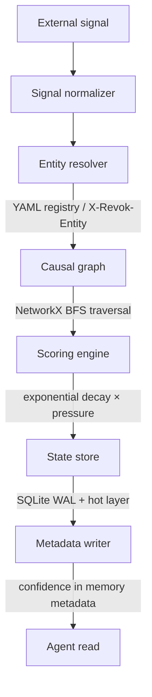

<!-- LOGO PLACEHOLDER — replace src with your logo once uploaded (e.g. docs/assets/logo.png) -->
<div align="center">
  

  <h1>Revok</h1>

  <p><strong>The memory validity layer for AI agents.</strong></p>

  <p>
    Every memory system updates beliefs from conversation.<br/>
    None listen to the world changing around them. <strong>Revok does.</strong>
  </p>

  <p>
    <a href="#license"></a>
    
    
    
    <a href="#contributing"></a>
  </p>

  <p>
    <a href="#quick-start">Quick start</a> ·
    <a href="#how-it-works">How it works</a> ·
    <a href="#examples">Examples</a> ·
    <a href="#roadmap">Roadmap</a>
  </p>
</div>

<!-- DEMO PLACEHOLDER — replace with a screenshot or GIF of the dashboard once uploaded -->
<div align="center">
  
</div>

---

## Table of contents

- [The problem](#the-problem)
- [The solution](#the-solution)
- [Features](#features)
- [Quick start](#quick-start)
- [How it works](#how-it-works)
- [Architecture](#architecture)
- [Configuration](#configuration)
- [HTTP API](#http-api)
- [Confidence states](#confidence-states)
- [Examples](#examples)
- [Roadmap](#roadmap)
- [Contributing](#contributing)
- [License](#license)

---

## The problem

Your agent tells a customer the item is **in stock**.
It sold out 20 minutes ago.

Your agent has no idea — because no memory system listens to the world.

Memory layers today — Mem0, Zep, and the rest — track *when a memory was stored*,
not *whether it is still true*. The moment reality changes, your agent is
confidently wrong.

**Stale memory ships bugs everywhere agents touch a changing world:**

- 🛒 **Commerce** — "it's in stock" → sold out
- 💰 **SaaS** — quotes old pricing → undercharges the deal
- 🎫 **Support** — "you're eligible for a refund" → policy changed last week
- 📅 **Scheduling** — "that slot is open" → booked an hour ago
- 🔐 **Access** — "you're on the free plan" → upgraded yesterday

Revok fixes this.

---

## The solution

Revok sits between your agent and its memory store as a **transparent HTTP proxy**.
It listens for real-world signals, resolves which memories are affected using a
**causal graph**, and attaches a **confidence score** at retrieval time.

> **Zero agent refactoring required.** Drop it in front of Mem0 and your existing
> code keeps working — now with a confidence signal it never had before.

```python
# Your existing code — completely unchanged
memories = mem0.search(query, user_id=user_id)

# Confidence is already in the response
# {
#   "content": "The Apex Hoodie is in stock",
#   "metadata": { "revok_confidence": 0.26, "revok_status": "stale" }
# }
```

Signal processing is async. **Zero added read latency.**

---

## "But my system is context-aware"

Maybe you already do context engineering — RAG, live tool calls, fresh retrieval
injected at prompt time. Good. That brings *new* data into the context window.

It still doesn't tell you whether the **stored beliefs** your agent reasons over
are *still valid*.

> Bringing the change into context ≠ knowing what the change invalidated.

Concretely:

- **RAG fetches a fresh document** — but the agent's memory still holds a summary
  from last week, and nothing reconciles the two. Which one does it trust?
- **A tool call returns live data** — but only for the *one* entity you queried.
  The signal that "supplier pricing changed" should also degrade the cached ROI,
  the quote, and the comparison — every downstream belief it touches.
- **You re-embed and re-index** — that updates *retrieval relevance*, not
  *truth*. A confidently retrieved, perfectly relevant memory can still be stale.

Context engineering answers *"what's relevant right now?"*
Revok answers *"is what I already believe still true?"* — and propagates a single
real-world signal across every memory it invalidates via the causal graph. The two
are complementary: keep your retrieval, add a validity layer underneath it.

---

## Features

- 🔌 **Drop-in proxy** — sits in front of Mem0 over HTTP; no SDK, no code changes.
- 🧠 **Confidence at retrieval** — every memory carries a freshness score and status.
- 🌐 **World-aware** — ingests external signals (CDC, webhooks, streams) that invalidate beliefs.
- 🕸️ **Causal graph** — one signal can degrade every downstream memory it affects (NetworkX BFS).
- ⏱️ **Time decay + pressure** — confidence recovers over time and drops under signal pressure.
- ⚡ **Async, low-latency** — built on `asyncio` + `aiohttp`; reads are never blocked.
- 💾 **Durable state** — SQLite WAL with an in-memory hot layer.
- 🧩 **Flexible entity matching** — catalog aliases, regex patterns, or `X-Revok-Entity` headers.

---

## Quick start

### Prerequisites

- Python **3.11+**
- A running [Mem0](https://mem0.ai) instance (or use the Docker demos below)

### Install

```bash
# Clone
git clone https://github.com/your-org/revok.git
cd revok

# Create a virtual environment and install
python -m venv .venv
source .venv/bin/activate        # Windows: .venv\Scripts\Activate.ps1
pip install -e ".[dev]"
```

### Configure

```bash
cp config/revok.example.yaml revok.yaml
# Edit revok.yaml — point `upstream.mem0_url` at your Mem0 instance
# and register the entities you want to track.
```

### Run

```bash
revok --config revok.yaml
# → Revok listening on http://127.0.0.1:8080
```

Point your agent's Mem0 client at the Revok URL instead of Mem0 directly. That's it.

---

## How it works

A real-world signal arrives, Revok figures out which memories it touches, and the
next time those memories are read they come back with a confidence score.



Reads flow straight through the proxy to Mem0 and back — enriched, never delayed.
Signal processing happens asynchronously on a separate path.

---

## Architecture

<!-- ARCHITECTURE DIAGRAM PLACEHOLDER — replace with your diagram image once uploaded -->
<div align="center">
  
</div>

```
External signal
      ↓
Signal normalizer
      ↓
Entity resolver   ←  YAML entity registry / X-Revok-Entity header
      ↓
Causal graph      ←  NetworkX BFS traversal
      ↓
Scoring engine    ←  exponential decay × signal pressure
      ↓
State store       ←  SQLite WAL + in-memory hot layer
      ↓
Metadata writer   →  confidence score in memory metadata
```

---

## Configuration

Revok is configured with a single YAML file. A minimal example:

```yaml
server:
  host: "127.0.0.1"
  port: 8080

upstream:
  mem0_url: "http://localhost:8000"
  write_methods: ["POST", "PUT", "PATCH"]
  write_paths: ["/v1/memories"]

entity_matcher:
  entities:
    - id: "apex_hoodie"
      display_name: "Apex Fleece Hoodie"
      aliases: ["Apex Hoodie", "apex fleece", "SKU-1042"]

scoring:
  half_life_seconds: 86400      # confidence recovers to 0.5 after 24h
  signal_strength: 0.4          # how much each signal subtracts
  score_cap: 1.0
```

See [`config/revok.example.yaml`](config/revok.example.yaml) for the fully
documented configuration, including pattern mode and header-tagged mode for
large catalogs.

---

## HTTP API

Revok forwards everything to Mem0 transparently, and adds a small read-only API
for inspecting confidence state:

| Method   | Path                          | Description                          |
|----------|-------------------------------|--------------------------------------|
| `GET`    | `/v1/entities`                | Paginated list of all entity records |
| `GET`    | `/v1/entities/{entity_key}`   | Single entity record (or `404`)      |
| `DELETE` | `/v1/entities/{entity_key}`   | Remove an entity record              |
| `*`      | `/{any other path}`           | Transparently proxied to Mem0        |

To attach a signal to a write, send the entity with the request header:

```http
X-Revok-Entity: apex_hoodie
```

---

## Confidence states

| Status     | Score   | Meaning            |
|------------|---------|--------------------|
| `fresh`    | > 0.7   | Memory is reliable |
| `degraded` | 0.3–0.7 | Use with caution   |
| `stale`    | < 0.3   | Do not trust       |

---

## Examples

Runnable end-to-end demos live in [`examples/`](examples/):

| Demo | What it shows |
|------|---------------|
| [`mem0_basic`](examples/mem0_basic/) | Revok proxying Mem0: a pricing change fires a signal and confidence degrades. |
| [`langgraph_pricing`](examples/langgraph_pricing/) | A LangGraph agent that re-verifies from the live DB when memory goes stale, with a live dashboard. |
| [`crewai_pricing`](examples/crewai_pricing/) | The same stale-memory scenario built on CrewAI. |

Each demo ships with a `docker compose` setup and a step-by-step walkthrough in
its own README.

---

## Roadmap

**Memory adapters**

| Adapter   | Status      |
|-----------|-------------|
| Mem0      | ✅ v0.1.0   |
| Zep       | 🔜 v0.2.0   |
| Redis AMR | 🔜 v0.3.0   |

**Signal sources**

| Source            | Tier       |
|-------------------|------------|
| Webhooks          | OSS        |
| Redis Streams     | OSS        |
| Azure Event Hubs  | Enterprise |
| AWS EventBridge   | Enterprise |
| Google Pub/Sub    | Enterprise |

**OSS limits:** ~1,000 signals/minute · single-process deployment · self-hosted only.
The Enterprise tier adds multi-tenancy, managed cloud signal sources, SSO/RBAC,
audit logging, and a SaaS dashboard.

---

## Contributing

Contributions are welcome! To get started:

```bash
pip install -e ".[dev]"
pytest                 # run the test suite
ruff check .           # lint
mypy revok             # type-check
```

Please open an issue to discuss substantial changes before sending a PR.

---

## License

[AGPL v3](LICENSE). Enterprise licensing available — contact **[your email]**.

---

## Status

`v0.1.0` — MVP. Mem0 adapter. Production use at your own risk. Feedback welcome.
